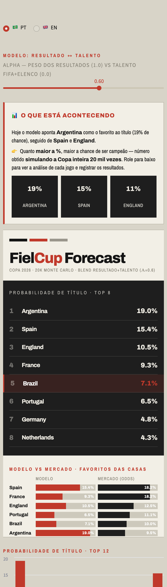
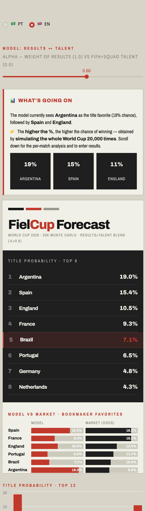
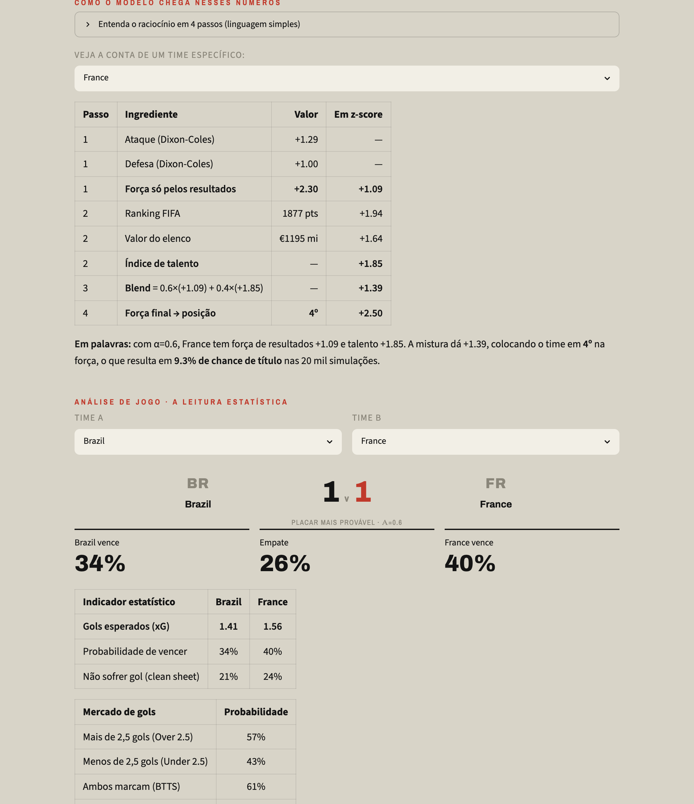

# FielCup — Quem vai ganhar a Copa de 2026? ⚽

> Um modelo estatístico que prevê cada jogo da Copa 2026 e **simula o torneio
> inteiro 50.000 vezes** para estimar a chance de título de cada seleção.
> Pipeline completo de ciência de dados: coleta, SQL, modelo, simulação,
> validação e um **dashboard interativo que abre no celular**.

<p align="center">
  <a href="https://fielcup.streamlit.app">
    
  </a>
</p>

<p align="center">
  <b><a href="https://fielcup.streamlit.app">👉 Clique aqui para entrar no FielCup</a></b><br>
  <sub>Abre no celular e no computador · veja <a href="docs/ACESSO_CELULAR.md">como publicar o seu link grátis em 2 minutos</a></sub>
</p>


### 📱 Como fica na tela · How it looks · 🇧🇷 PT / 🇬🇧 EN

O dashboard é **bilíngue**: um botão **🇧🇷 PT / 🇬🇧 EN** no topo troca todo o
texto entre português e inglês. / *The dashboard is **bilingual**: a
**🇧🇷 PT / 🇬🇧 EN** switch at the top toggles the whole UI.*

<p align="center">
  
  &nbsp;&nbsp;
  
</p>
<p align="center">
  
</p>

<p align="center">
  <sub>📱 Visão no celular em PT e EN (resumo + ranking de favoritos). Abaixo, a
  análise estatística de um jogo: gols esperados (xG), probabilidades, over/under,
  ambos marcam, e a conta passo a passo de cada número.<br>
  <i>Mobile view in PT and EN. Below, the per-match statistical read: expected
  goals (xG), win/draw/loss, over/under, BTTS, and the step-by-step math.</i></sub>
</p>

> ⚠️ O link acima fica ativo **depois** que você fizer o deploy (1x, ~2 min).
> O passo a passo — incluindo como reservar o endereço `fielcup.streamlit.app` —
> está em [`docs/ACESSO_CELULAR.md`](docs/ACESSO_CELULAR.md).

## What it answers

**"What is each nation's real chance of winning the World Cup 2026?"**

Instead of guessing, FielCup builds the answer from ~8,000 real
international matches, models the goal distribution of any fixture, and
plays the entire tournament tens of thousands of times.

### Model top 6 (blend resultado + talento, α=0.6)

| # | Nation | Title prob. | Market (odds) |
|---|--------|-------------|---------------|
| 1 | Argentina | 18.5% | ~9.5% |
| 2 | Spain | 14.8% | ~18% |
| 3 | England | 10.2% | ~12% |
| 4 | France | 9.8% | ~18% |
| 5 | Brazil | 7.6% | ~10% |
| 6 | Portugal | 6.4% | ~11% |

O modelo agora combina a força medida nos resultados (Dixon-Coles) com um
**prior de talento** (ranking FIFA + valor de elenco). Isso traz a **França
de fora do top 7 para o 4º** e modera a Argentina — alinhando o topo ao
consenso dos especialistas (Espanha, França, Argentina, Brasil). O botão
`α` controla a mistura: **α=1.0 reproduz o modelo antigo** (Argentina 22%),
**α≈0.3 deixa Espanha/França/Argentina praticamente empatadas** no topo.
A análise da divergência está em `docs/ANALISE_modelo_vs_especialistas.md`.

## How it works

1. **SQL data layer.** All data lives in a single SQLite database
   (`db/fielcup.db`). Cleaning, the train/target split and feature
   aggregations are done in SQL; Python only consumes clean query results.
2. **Dixon-Coles model.** Goals follow a Poisson distribution whose mean
   combines a team's attack strength, the opponent's defense strength and
   home advantage. The Dixon-Coles correction adjusts low scores and applies
   time decay (recent games weigh more). Parameters are fit by maximum
   likelihood.
3. **Talent blend (the fix).** Pure match results overrate Argentina and
   underrate France. The model blends the Dixon-Coles strength with a
   **talent prior** (FIFA ranking points + Transfermarkt squad value) via a
   tunable knob `α`: `s = α·z(results) + (1−α)·z(talent)`. This is the signal
   the results-only model was blind to.
4. **Neutral-venue aware.** Home advantage is only applied to non-neutral games.
5. **Monte Carlo simulation.** The tournament is simulated 50,000 times
   (fully vectorized in numpy): group stage with FIFA tiebreakers, the 8 best
   third-placed teams, and a simplified knockout bracket to the final.
6. **Backtesting validation.** Trained only on pre-November-2022 data, the
   model predicted WC2022 (unseen) and beats a naive baseline by **+5.2%** on
   the Brier score, at **46.9%** accuracy.

## Project structure

```
fielcup/
├── data/
│   ├── raw/results.csv           # raw match history (1872-2026)
│   ├── reference/talento_2026.csv  # FIFA ranking + squad value (talent prior)
│   └── processed/                # clean data + model + results
├── db/fielcup.db                 # SQLite — single source of truth
├── src/
│   ├── data_collection.py        # 1. collection
│   ├── database.py               # 2. SQL layer (build db, query helpers)
│   ├── features.py               # 3. cleaning & features (in SQL)
│   ├── dixon_coles.py            # 4. the results model
│   ├── talento.py                # 5. results + talent blend (α knob)
│   ├── simulate.py               # 6. Monte Carlo
│   ├── evaluate.py               # 7. backtesting validation
│   └── api_collector.py          # live updates via API-Football
├── app/dashboard.py              # 8. Streamlit dashboard
└── requirements.txt
```

## Run it

All scripts are run from the project root.

```bash
python -m venv venv && source venv/bin/activate
pip install -r requirements.txt

python src/database.py      # 1. build SQLite db from the CSVs
python src/features.py      # 2. train/target split & features (SQL)
python src/dixon_coles.py   # 3. train the Dixon-Coles model
python src/talento.py       # 4. show the results+talent blend effect
python src/simulate.py      # 5. run 50,000 Monte Carlo simulations
python src/evaluate.py      # 6. validate (backtest on WC2022)

streamlit run app/dashboard.py   # launch the dashboard (α slider + model vs market)
```

Inspect the data directly with SQL at any time:

```bash
sqlite3 db/fielcup.db "SELECT selecao, ROUND(prob_titulo*100,1) AS pct \
  FROM title_probabilities ORDER BY prob_titulo DESC LIMIT 8;"
```

## Keeping it updated during the tournament

New results come in daily. The `api_collector.py` script pulls finished
matches from API-Football and merges them into the dataset:

```bash
export API_FOOTBALL_KEY="your_key"   # free key at dashboard.api-football.com
python src/api_collector.py --update-results
python src/features.py && python src/dixon_coles.py && python src/simulate.py
```

To run this automatically (no manual work for 104 games), see
`docs/PLANO_EXPANSAO.md` for a GitHub Actions setup that updates the data on a
schedule in the cloud.

**Or update by hand, live, in the dashboard.** The dashboard has a *"Durante a
Copa"* editor: type the real group-stage scorelines as they happen and the whole
forecast re-computes **conditioned on what already occurred** (that match stops
being simulated and becomes a fact). It also has a *"Como o modelo pensa"* panel
that explains the method in plain language and shows the full calculation
(attack/defense → z-scores → talent → blend → title %) for any team you pick.

## Limitations (honest)

- **Simplified bracket.** FIFA uses a fixed table that separates top seeds;
  the model shuffles qualifiers. Qualification probabilities are exact;
  title probabilities are an approximation.
- **Talent prior is static.** The FIFA points and squad values are a snapshot
  (June 2026); they don't react to in-tournament injuries or form. Some lower
  teams' squad values are estimated from FIFA points (flagged in the CSV).
- **`α` is a modelling choice, not ground truth.** It trades off "what results
  say" against "what talent says"; the default 0.6 is a reasoned pick, not an
  optimum fitted on outcomes.
- **Rare tiebreakers** and extra time / penalties are approximated.

## Stack

Python · pandas · numpy · scipy · **SQLite / SQL** · Streamlit ·
Dixon-Coles bivariate Poisson · results+talent blend · vectorized Monte Carlo ·
FIFA ranking + Transfermarkt squad value · API-Football (live updates).

---

*Portfolio data science project. Not betting advice.
Data source: martj42/international_results.*
